# HVCCPS V1.4

  <strong>English</strong> | <a href="README_zh.md">简体中文</a>

📺 **Project overview video:** [Watch on Bilibili](https://www.bilibili.com/video/BV1GMjm6cExY)

**QQ group: 582594264**

> [!CAUTION]
> This project generates lethal high voltage. The output and capacitors may retain substantial energy after power is removed. Provide adequate insulation before testing or operation. Do not use this device without high-voltage experience or without another person present.

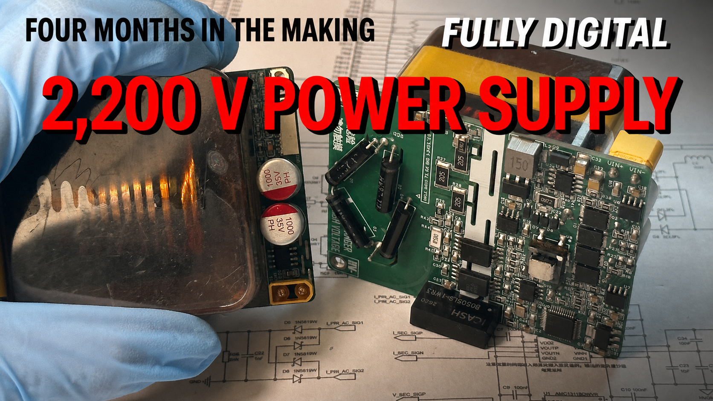

## Project Popularity and Support

If you find this project helpful, please consider giving it a Star ⭐

## 1. Introduction

### 1.1 Overview

HVCCPS V1.4 is a digitally controlled high-voltage DC-DC power supply based on the **STM32G474CBT6**. Its power stage uses a **PSFB (Phase-Shifted Full Bridge)** topology. It is designed for charging high-voltage capacitors and for general laboratory high-voltage use. The public firmware supports **CV (constant voltage), CC (constant current), and CP (constant power)** control.

Under the recommended operating conditions, the input range is 18–28 V DC. The public firmware limits the output to **0–2200 V, 0–200 mA, and 0–400 W**. The power density is approximately **40 W/in³**.

The PCB was designed in EasyEDA Pro. This repository includes the complete [EasyEDA project](PCB/ProPrj_HVCCPS_V1.4_Release.epro2), [Gerber files](PCB/Gerber_HVCCPS_V1.4.zip), and [BOM](Docs/BOM.xlsx) for replication and further development.

### 1.2 Firmware and license

To discourage closed-source commercial use and closed-source copying, the public repository currently provides compiled firmware only; the firmware source is not included directly in the public branch. The source code is available **free of charge** by joining QQ group **582594264** or emailing **Lanyyontop@gmail.com**.

The public contents of this repository are licensed under [GPL-3.0](LICENSE). When obtaining, modifying, or redistributing the source or derivative works, comply with the license terms.

## 2. Specifications

### 2.1 Electrical specifications

| Parameter | Minimum | Typical | Maximum | Unit | Notes |
|---|---:|---:|---:|:---:|---|
| Input voltage (DC) | 18 | 24 | 28 | V | Rated input-voltage range |
| Input current (DC) | — | — | 20 | A | Rated input current |
| Output voltage (DC) | 0 | Adjustable | 2200 | V | — |
| Output current (DC) | 0 | Adjustable | 200 | mA | — |
| Output power (DC) | 0 | Adjustable | 400 | W | — |
| Switching frequency | 11 | 35 | 45 | kHz | Automatic frequency control by default; 35 kHz reference frequency |
| Gate-driver dead time | — | 200 | — | ns | — |
| Conversion efficiency | — | — | 96 | % | Measured peak; see the [efficiency test data](Test_Data/efficiency-test.txt) |
| Output-voltage step | — | 1 | — | V | — |
| Output-current step | — | 1 | — | mA | — |
| Output-voltage accuracy | — | — | ±0.5 | % | — |
| Output-current accuracy | — | — | ±1 | % | — |
| Power density | — | 40 | — | W/in³ | Based on the effective assembled volume |
| Total weight | — | 292 | — | g | — |

> [!NOTE]
> The 28 V value is the upper limit of the recommended operating range. The bus capacitors are rated for 35 V; never exceed 35 V.

### 2.2 Control and protection

| Item | Parameter | Description |
|---|---|---|
| Control modes | CV / CC / CP | Automatic arbitration among three PI loops |
| Fixed-duty mode | 0–100% | For debugging only; still constrained by soft start |
| Soft start | Duty may increase by at most 10% per control cycle | Default value; adjustable in the host configuration manager |
| Run timer | Continuous or 1–65534 s | Automatically disables the output when the timer expires |
| Supply UVLO / OVP | Bus >32 V; window protection for 12 V, 5 V, and 3.3 V rails | Internally suppresses the physical output while preserving software enable state and communications |
| Hardware overcurrent protection (OCP) | Approximately 60 A AC peak at the primary-side SW node | COMP1 → HRTIM FAULT4 asynchronous shutdown; **this is not a 60 A rated input current** |
| Software overtemperature protection (OTP) | 70 °C | Shuts down if either the MOSFET NTC or the MCU internal temperature exceeds the threshold |
| Independent watchdog (IWDG) | Approximately 200 ms | Resets the controller if the main loop or control ISR stalls |
| Buttons | Two A/B presets | Stores CV, CC, CP, and run time; supports offline operation and shutdown |

OCP and OTP both latch the shutdown state. Starting again clears the latch; if the fault condition is still present, protection trips immediately again.

### 2.3 Controller and communications

| Item | Specification |
|---|---|
| MCU | STM32G474CBT6 |
| External crystal | 8 MHz HSE |
| System clock | 170 MHz |
| Communication interface | USART3, PB10 (TX) / PB11 (RX) |
| Serial format | 115200 baud, 8N1 |
| Host interface | WebSerial |
| Input connector | XT30 |
| High-voltage output connector | M3 |

### 2.4 High-voltage-side design notes

All PCB clearances on the high-voltage secondary side are **≥ 9.5 mm**. The design may be modified to support a higher output voltage when required.

For a higher output voltage, recalculate and validate the transformer turns ratio, rectifier diodes, output capacitors, and feedback network, and update the firmware parameters accordingly.

## 3. Architecture

### 3.1 PCB layout

The PCB uses **4 layers, a 1.6 mm board thickness, and 1 oz copper**. Common resistors and capacitors use 0805 packages for easier assembly. The main power transformer is primarily on the top side; the gate-drive, control, and sensing circuits are primarily on the bottom side.

| Top | Bottom |
|---|---|
| 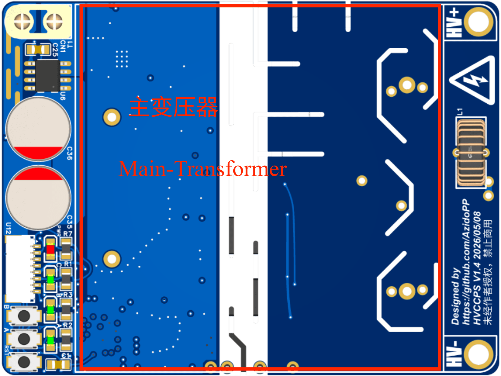 | 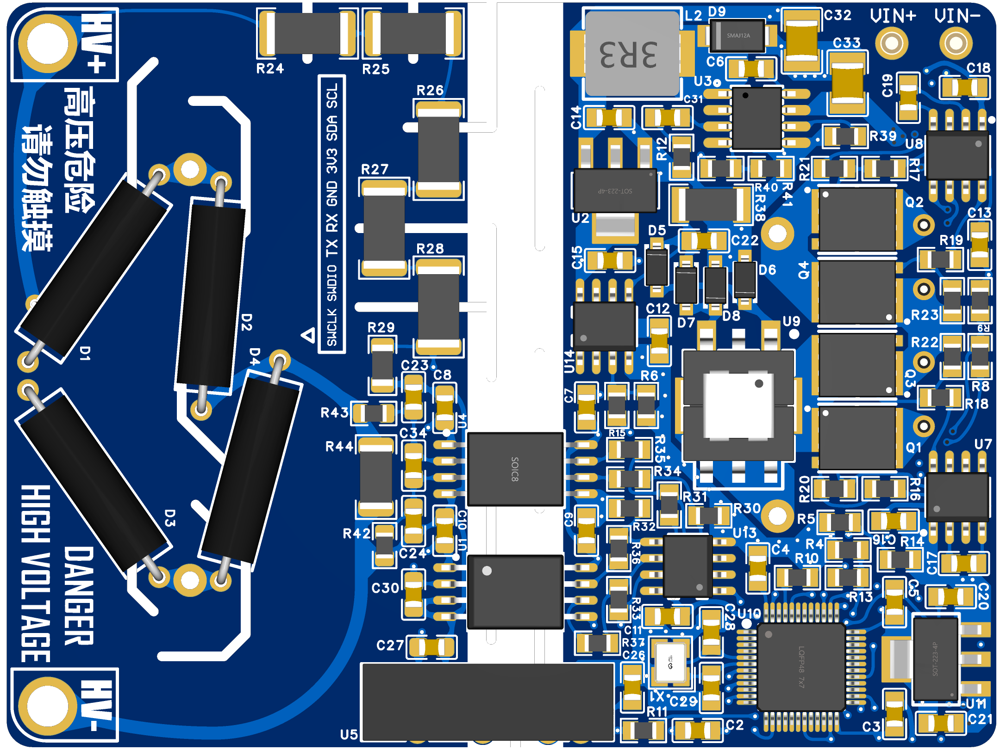 |

### 3.2 Power architecture

The power stage uses a PSFB topology and regulates transferred power by varying the phase shift between the two bridge-leg pairs.

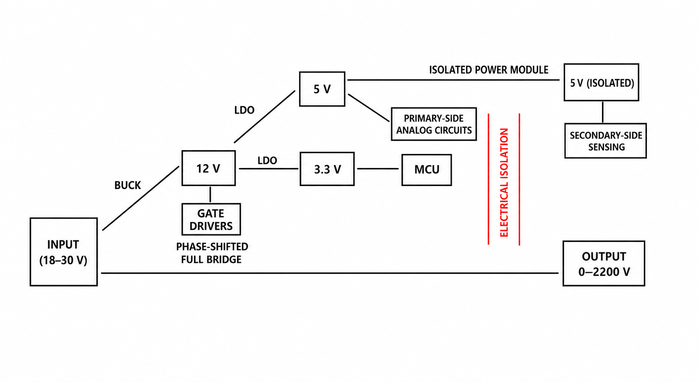

### 3.3 Hardware architecture

The controller samples voltage, current, temperature, and auxiliary supplies. HRTIM generates the four full-bridge drive signals with fixed dead time. An independent comparator and HRTIM Fault path provide hardware overcurrent shutdown.

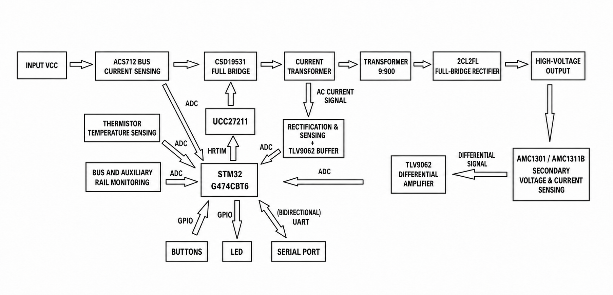

### 3.4 Control-strategy architecture

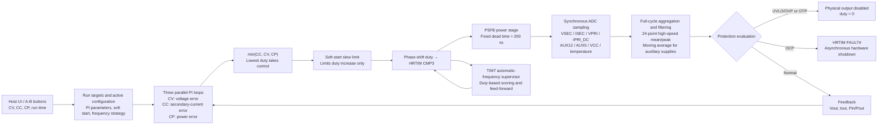
```mermaid
%%{init: {"flowchart": {"htmlLabels": true, "nodeSpacing": 70, "rankSpacing": 95}, "themeVariables": {"fontSize": "18px"}} }%%
flowchart LR
  Host["Host UI / A-B buttons<br/>CV, CC, CP, run time"] --> Cmd["Run targets and active configuration<br/>PI parameters, soft start, frequency strategy"]
  ADC["Synchronous ADC sampling<br/>VSEC / ISEC / VPRI / IPRI_DC<br/>AUX12 / AUX5 / VCC / temperature"] --> Filter["Full-cycle aggregation and filtering<br/>24-point high-speed mean/peak<br/>Moving average for auxiliary supplies"]
  Filter --> Protect{"Protection evaluation"}
  Protect -->|"UVLO/OVP or OTP"| GateOff["Physical output disabled<br/>duty = 0"]
  Protect -->|"OCP"| Fault["HRTIM FAULT4<br/>Asynchronous hardware shutdown"]
  Protect -->|"Normal"| Fb["Feedback<br/>Vout, Iout, Pin/Pout"]
  Cmd --> PI["Three parallel PI loops<br/>CV: voltage error<br/>CC: secondary-current error<br/>CP: power error"]
  Fb --> PI
  PI --> Min["min(CC, CV, CP)<br/>Lowest duty takes control"]
  Min --> Slew["Soft-start slew limit<br/>Limits duty increase only"]
  Slew --> Duty["Phase-shift duty → HRTIM CMP3"]
  Duty --> PSFB["PSFB power stage<br/>Fixed dead time ≈ 200 ns"]
  PSFB --> ADC
  Duty --> Freq["TIM7 automatic-frequency supervisor<br/>Duty-based scoring and feed-forward"]
  Freq --> Duty
```

The controller is effectively a **three-loop parallel duty limiter**: the CV, CC, and CP PI controllers each produce an allowed phase-shift duty, and the firmware selects the smallest value. The result passes through the soft-start slew limiter before being written to HRTIM.

## 4. Fabrication and assembly

### 4.1 PCB fabrication

Order the PCB using the [Gerber files](PCB/Gerber_HVCCPS_V1.4.zip) in this repository. Recommended parameters:

- Layers: 4
- Board thickness: 1.6 mm
- Outer-layer copper: 1 oz
- Inner-layer copper: 0.5 oz

### 4.2 Transformer

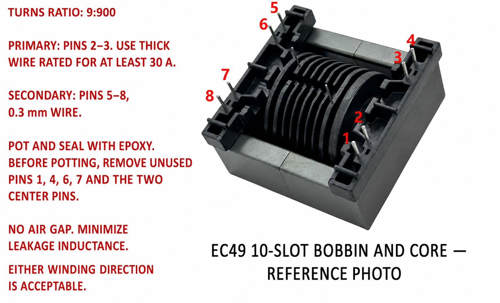

| Item | Specification |
|---|---|
| Core | EC49, material 40 |
| Turns | 9 primary, 900 secondary |
| Turns ratio | 1:100 |
| Primary winding pins | 2–3 |
| Secondary winding pins | 5–8 |
| Secondary wire diameter | 0.3 mm |
| Air gap | None required |
| Other requirements | Minimize leakage inductance; pot and seal after winding |

Use the thickest practical wire for the primary winding, with a current capacity of **≥ 30 A**. Before potting, remove pins 1, 4, 6, and 7 plus the two unused center pins. Either winding direction is acceptable.

The transformer used in this project was custom-made by the [Xiangrun Electronic Core & Bobbin Taobao store](https://shop339657327.taobao.com).

> [!NOTE]
> After manufacturing, the transformer should have less than 10 µH leakage inductance and more than 300 µH magnetizing inductance.

### 4.3 BOM and key components

The complete bill of materials is available at [Docs/BOM.xlsx](Docs/BOM.xlsx). Pay particular attention to the following parts when purchasing:

> [!IMPORTANT]
> Use the [Docs/BOM.xlsx](Docs/BOM.xlsx) file provided with this documentation and the key-component notes in this section as the source of truth. Do not use the BOM exported from the Lichuang EDA project.

| Reference | Part / recommendation | Notes |
|---|---|---|
| L1 | [Reference link](https://item.taobao.com/item.htm?id=524929973196) | — |
| R8 | 10 kΩ NTC, B = 3450 K ([reference link](https://detail.tmall.com/item.htm?id=610279139920)) | Check the B value |
| Q1–Q4 | CSD18540 or CSD19531 | Verify the source of the MOSFETs |
| R24–R28 | Viking high-voltage resistors, 2 MΩ, 2512, 3000 V ([reference link](https://item.taobao.com/item.htm?id=987002402599)) | — |
| U7, U8 | UCC27211; SLM27211 is a substitute | Counterfeit UCC27211 devices are common; SLM27211 is a pin-to-pin replacement |
| U9 | EE8.3 1:200 current transformer ([reference link](https://item.taobao.com/item.htm?id=721406076659)) | Ensure it is 1:200, not 1:100 |
| U6 | ACS712-20A | Use the 20 A-range version, not the 30 A version |

Purchase all remaining components according to the BOM.

### 4.4 Soldering and inspection

Solder paste with a hot plate or reflow oven is recommended for SMD assembly. This project assumes the builder is experienced with electronic assembly.

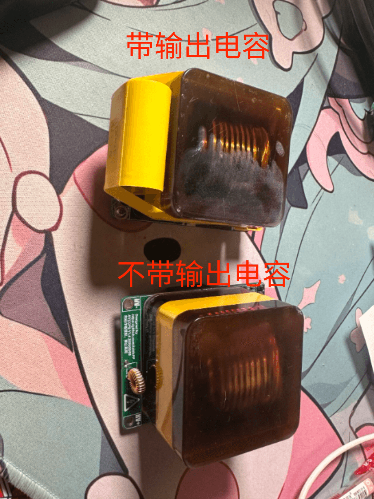

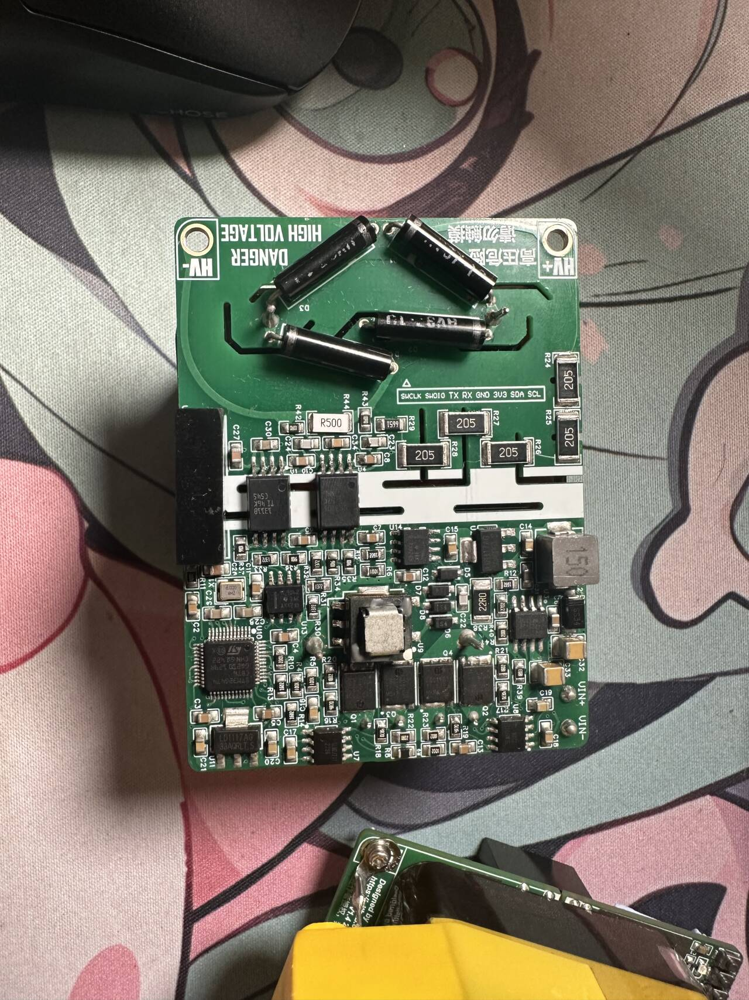

After soldering, verify the orientation of every IC—especially the gate drivers—using the package markings. Incorrect orientation can **destroy the main controller**.

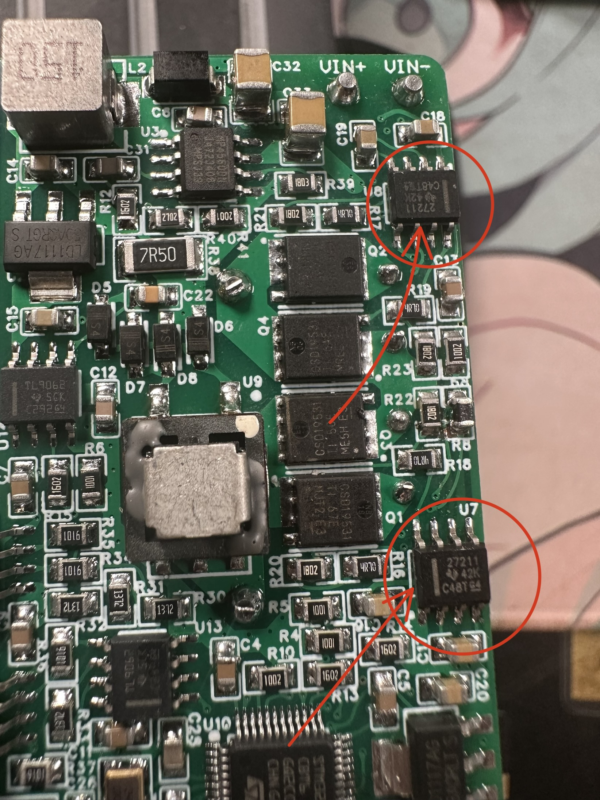

### 4.5 Output capacitor

For use as a general high-voltage supply, an external **4000 V, 0.2 µF** film capacitor may be connected as the output filter ([purchase link](https://item.taobao.com/item.htm?id=814880889031)). The capacitor may be omitted when the device is used as a high-voltage capacitor charger.

Solder terminals to the capacitor leads first, then fasten them to the output using screws.

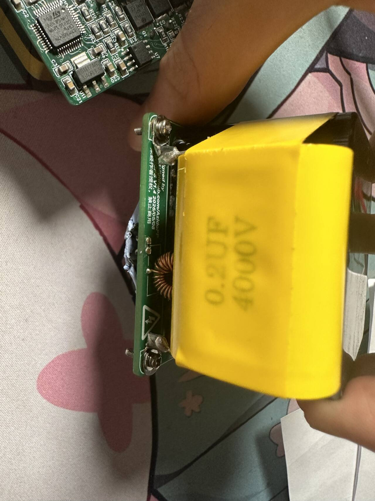

## 5. Firmware flashing and IAP updates

### 5.1 Firmware components

The released firmware consists of two Intel HEX files, available from [GitHub Releases](https://github.com/AzidoPP/HVCCPS-V1.4/releases):

| Firmware | Start address | Purpose |
|---|---|---|
| [Bootloader HEX](https://github.com/AzidoPP/HVCCPS-V1.4/releases/download/v0.0.1/HVCCPS_Bootloader_V0.0.1.hex) | `0x08000000` | Startup checks and serial IAP updates |
| [App HEX](https://github.com/AzidoPP/HVCCPS-V1.4/releases/download/v0.0.2/HVCCPS_App_V0.0.2.hex) | `0x08004000` | Power control, protection, telemetry, and host communication |

### 5.2 Preparation

Required equipment:

- ST-Link V2
- USB-to-TTL adapter
- SH1.0-to-2.54 mm adapter board
- SH1.0 cable

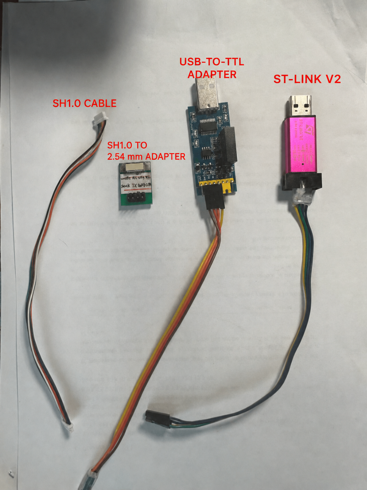

Install [STM32 ST-LINK Utility](https://www.st.com/en/development-tools/stsw-link004.html). It is also recommended to [download the current project as a ZIP](https://github.com/AzidoPP/HVCCPS-V1.4/archive/refs/heads/main.zip), or use the [online flasher](https://azidopp.github.io/HVCCPS-V1.4/BootLoaderHostUI/) and [online control interface](https://azidopp.github.io/HVCCPS-V1.4/AppHostUI/).

**See the complete procedure in the [firmware flashing video tutorial](https://github.com/AzidoPP/HVCCPS-V1.4/releases/download/videos-v1.4/HVCCPS-V1.4-Flashing-Tutorial.mp4).**

### 5.3 Flashing procedure

The board communication header exposes `SWCLK`, `SWDIO`, `TX`, `RX`, `GND`, `3.3 V`, `SDA`, and `SCL`, in that order. Flashing is performed in two stages:

| Stage | Required pins | Interface |
|---|---|---|
| Initial Bootloader flashing | `SWCLK`, `SWDIO`, `GND`, `3.3 V` | ST-Link V2 |
| App flashing via IAP | `TX`, `RX`, `GND`, `3.3 V` | USB-to-TTL adapter, with TX/RX crossed |

> [!WARNING]
> Disconnect the high-voltage output load before beginning. Make the system safe.

1. Connect the board's `SWCLK`, `SWDIO`, `GND`, and `3.3 V` pins to the corresponding ST-Link V2 pins.
2. Open STM32 ST-LINK Utility, select the Bootloader HEX file, and program it.

   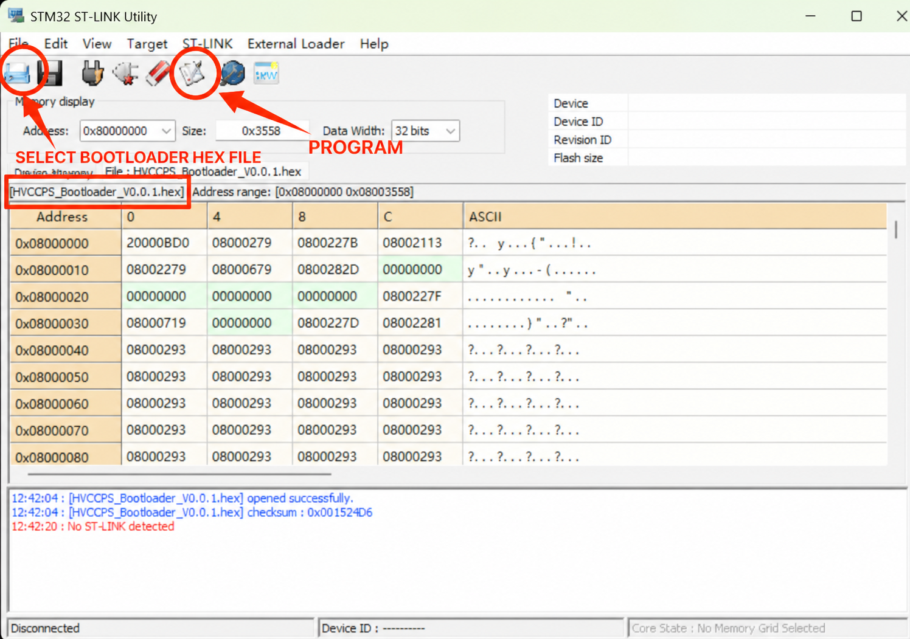

3. Reset the board after programming. If `LED_A` lights, the Bootloader has started successfully.
4. Disconnect the ST-Link. Connect the USB-to-TTL adapter to `TX`, `RX`, `GND`, and `3.3 V`; cross TX and RX.
5. Open [`BootLoaderHostUI/index.html`](BootLoaderHostUI/index.html) from the downloaded project, or use the [online IAP flasher](https://azidopp.github.io/HVCCPS-V1.4/BootLoaderHostUI/). Use the latest Chrome or Edge.
6. Connect the serial port in the page, select the App HEX file, click the flash button, and press the board's **RST** button.

   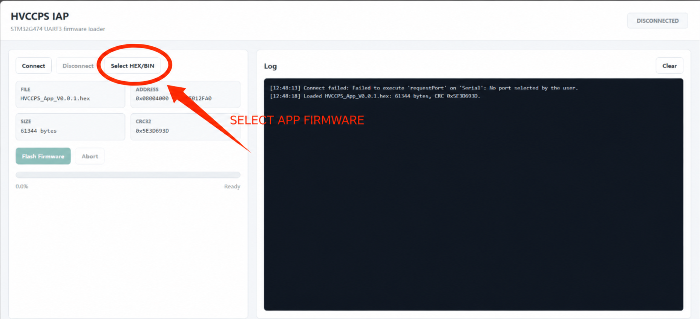

7. Wait for transfer and verification to finish. Reset the board again. If `LED_A` flashes continuously, the App has started successfully.

## 6. Host interfaces

### 6.1 Power-control interface

For offline use, download the project and open [`AppHostUI/index.html`](AppHostUI/index.html) directly in Chrome or Edge; no build step or network connection is required. You may also use the [online power-control interface](https://azidopp.github.io/HVCCPS-V1.4/AppHostUI/). When opened through `file://`, the browser cannot persist serial-port authorization, so the port must be selected again after reopening the page. Serve the directory from `http://127.0.0.1` if persistent authorization is preferred.

First-time users should watch the [host connection and control video tutorial](https://github.com/AzidoPP/HVCCPS-V1.4/releases/download/videos-v1.4/HVCCPS-V1.4-Host-Control-Tutorial.mp4).

- A fixed command bar for start/stop control and live CV, CC, and CP target updates without resetting a timed run
- Fixed-duty debugging with an explicit confirmation dialog before the open-loop command is sent
- Voltage, current, power, temperature, and protection-state telemetry
- Real-time plots and single-cycle sampled waveforms (the Y axis is calibrated to the reference signal, switched by clicking a legend chip; pausing freezes the view only, sampling continues so the trace stays continuous on resume)
- Configuration of PI parameters, switching frequency, automatic frequency control, and soft start
- Management of front-panel A/B button presets
- Chinese/English switching without moving the command or navigation controls
- A Tools area with run summaries, frame inspection, and declarative automatic test sequences
- Offline calibration-table editing and preview; a device connection is required only to write or enable calibration

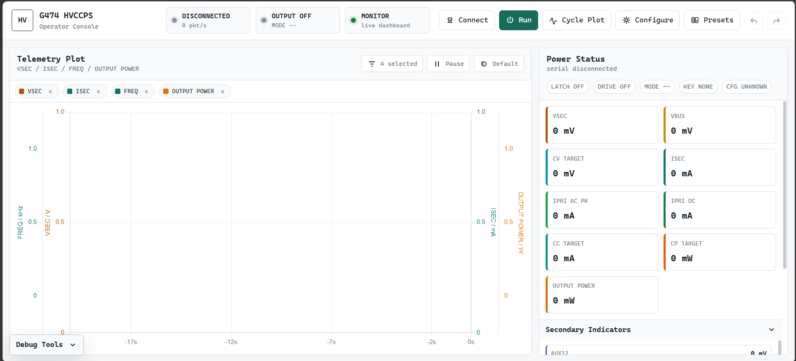

The connection uses **115200 baud, 8N1**. Use the latest Chrome or Edge, and open only one page that accesses the serial port at a time.

The interface remains plain HTML/CSS/JavaScript, but its implementation is split into `core`, `protocol`, `device`, `ui`, and `plugins` layers under `AppHostUI/src/`. `AppHostUI/src/loader.js` provides a small `HV.define()` / `HV.require()` registry so the modular source can still be loaded by ordinary script tags from `file://`. Extensions can register tool panels and status chips through the plugin host, and test or replay tooling can use the supported `window.HVCCPS` API.

### 6.2 Output calibration

Output V/I calibration requires **App firmware V0.0.3 or later**. The calibration table is stored in a flash area reserved independently of the App and is not erased by IAP App updates. Writing the table and enabling calibration both modify flash and must be performed while the output is off.

> [!CAUTION]
> Calibration still involves the high-voltage output. Turn the output off and confirm it has fully discharged before rewiring, measuring, changing meter ranges, or changing the load. Do not calibrate without supervision or adequate insulation.

1. Flash or update to App firmware V0.0.3, connect the power-control host interface, and confirm that serial communication works.
2. Open the **Calibrate** panel in the top bar. Initially leave **Apply calibration to the control loop** disabled.
3. Run the supply at the target voltage, current, and load point. Record the actual output using an external multimeter or high-voltage meter.
4. Stop the output and discharge it, then enter the samples in the calibration panel:
   - For a voltage point, enter the **RAW VSEC** shown by the host interface and the voltage measured by the external meter.
   - If the point corresponds to a fixed load current, also enter the externally measured current for load-dependent two-dimensional voltage correction.
   - For a current point, enter the displayed **RAW ISEC** and the externally measured current.
5. Start with 2–5 voltage points covering the normal operating region. A single point is acceptable if only one operating point matters. Add 1–3 current points across the normal load-current range as needed.
6. Click **Compile & Preview** and verify that the corrections are reasonable. Firmware clamps voltage correction to ±50 V and current correction to ±50 mA. Values beyond these limits indicate a likely sampling or external-measurement error.
7. Confirm that the output is still off, click **Write Table to Flash**, and wait for the upload to finish.
8. Enable **Apply calibration to the control loop**. The host interface writes the enable state to configuration flash.
9. Restart at low power and verify the output with the external meter. If the remaining error is too large, disable calibration and collect new RAW points, or add samples before writing the table again.

Always use RAW readings collected while calibration is disabled. Do not enter ordinary VSEC/ISEC values that already include calibration into the RAW columns, or the correction will be applied twice.

### 6.3 Bootloader interface

Both the local [`BootLoaderHostUI/index.html`](BootLoaderHostUI/index.html) page and the [online IAP flasher](https://azidopp.github.io/HVCCPS-V1.4/BootLoaderHostUI/) support Intel HEX parsing, address-range validation, serial handshaking, chunked transfer, progress display, and error logs. They are intended only for updating the App firmware.

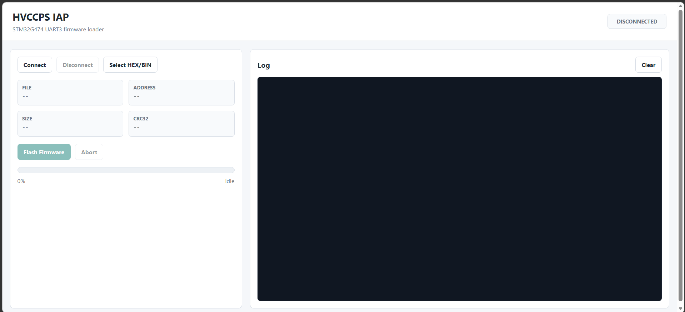

## 7. Testing

Project tutorials and test videos are collected in the [HVCCPS V1.4 video tutorials and tests release](https://github.com/AzidoPP/HVCCPS-V1.4/releases/tag/videos-v1.4).

Test instruments:

- SDS804X oscilloscope
- VC980D multimeter

### 7.1 ZVS turn-on

Measurements confirm zero-voltage switching of the main power MOSFETs: the switch-node voltage falls close to 0 V before the gate-drive signal turns the MOSFET on. The phase-shifted full bridge uses transformer leakage-inductance current for soft switching, reducing high-frequency switching loss.

Oscilloscope probe connections:

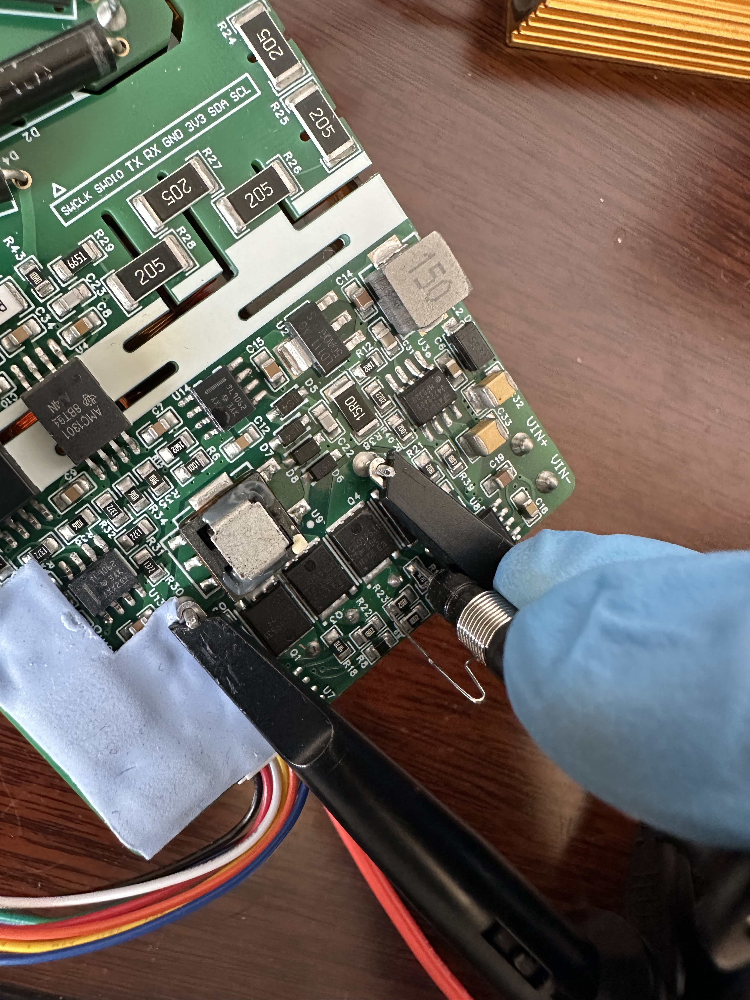

The measurement focuses on the lower MOSFET of the lagging bridge leg, where ZVS is harder to achieve. When the lagging leg meets the ZVS condition, the leading leg will usually achieve ZVS as well.

| ZVS waveform 1 | ZVS waveform 2 | ZVS waveform 3 |
|---|---|---|
| 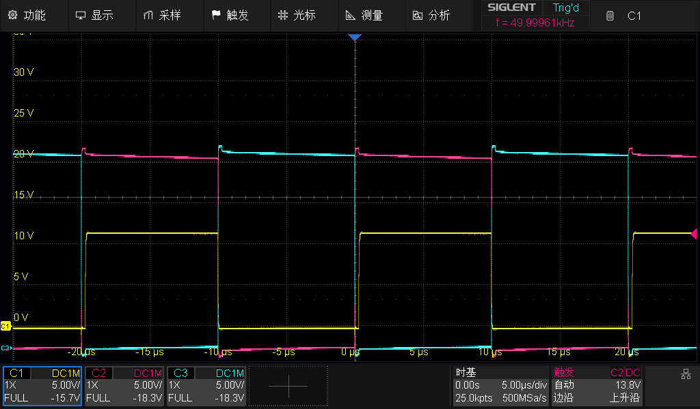 | 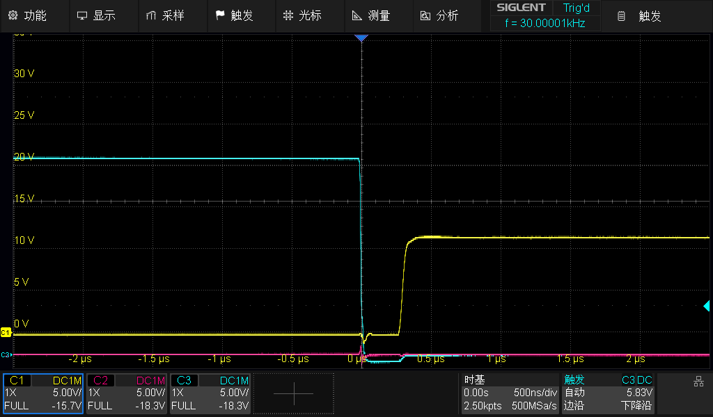 | 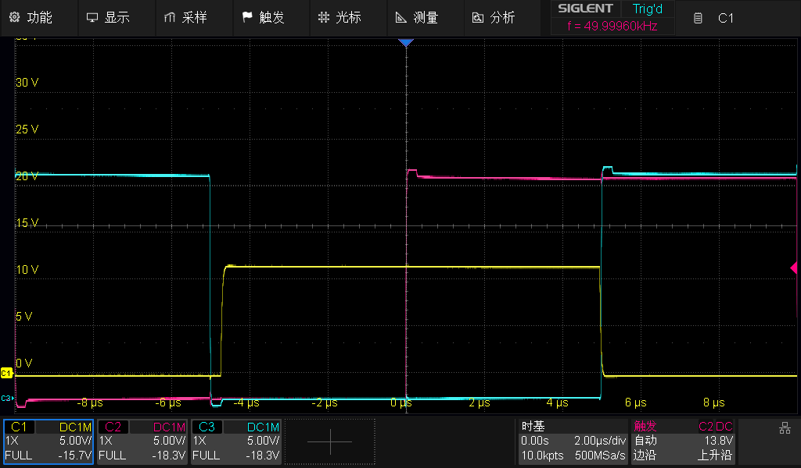 |

The blue traces are the lagging-leg SW node, the red traces are the leading-leg SW node, and the yellow traces are the lower gate-drive signal of the lagging leg.

> [!NOTE]
> This is a step-up supply, so primary current is substantially greater than secondary current. It can therefore achieve ZVS across a wide input range instead of only under heavy load.

### 7.2 Current waveforms

#### Primary current

| Waveform 1 | Waveform 2 |
|---|---|
| 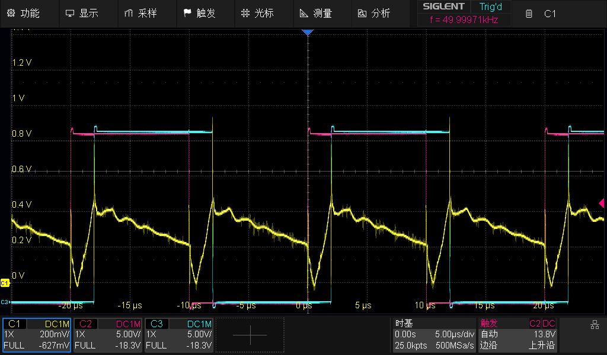 | 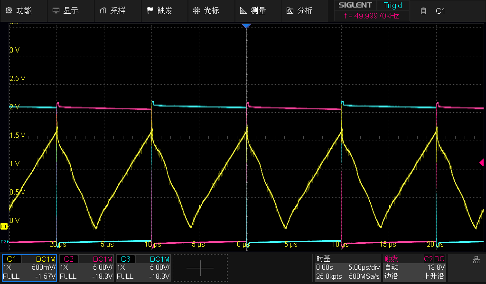 |

The blue traces are the lagging-leg SW node, the red traces are the leading-leg SW node, and the yellow traces are the voltage signal obtained after rectifying and sampling the current-transformer signal.

#### Secondary current

| Waveform 1 | Waveform 2 |
|---|---|
| 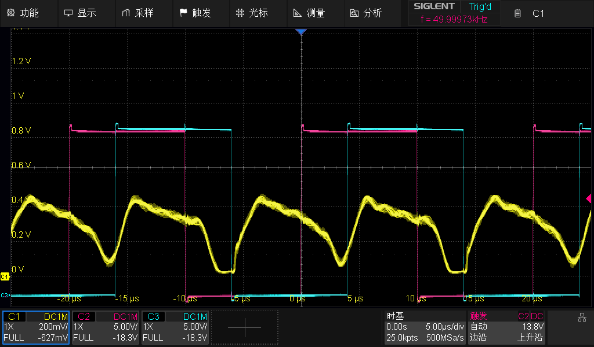 | 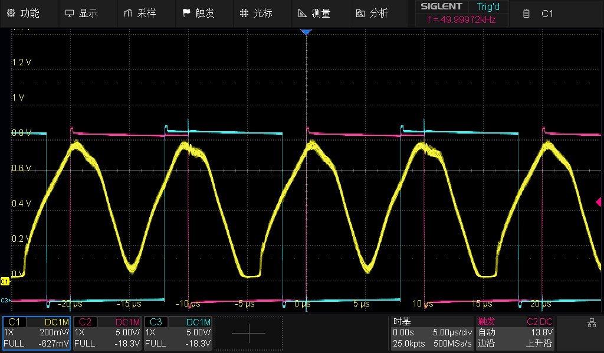 |

The blue traces are the lagging-leg SW node, the red traces are the leading-leg SW node, and the yellow traces are the AMC1301 sampling signal fed back to the primary side after differential amplification.

### 7.3 Voltage waveforms

| Secondary-voltage waveform 1 | Secondary-voltage waveform 2 |
|---|---|
| 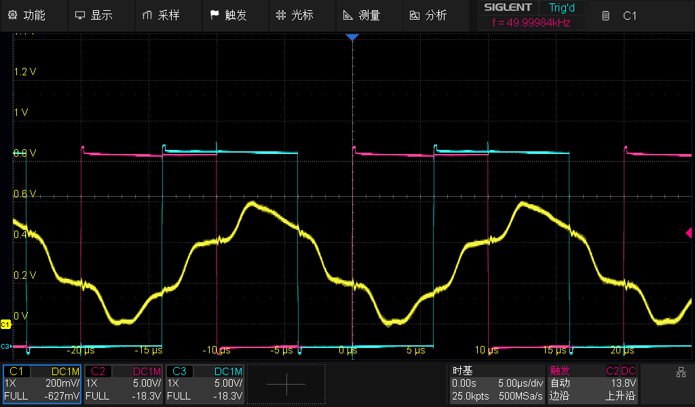 | 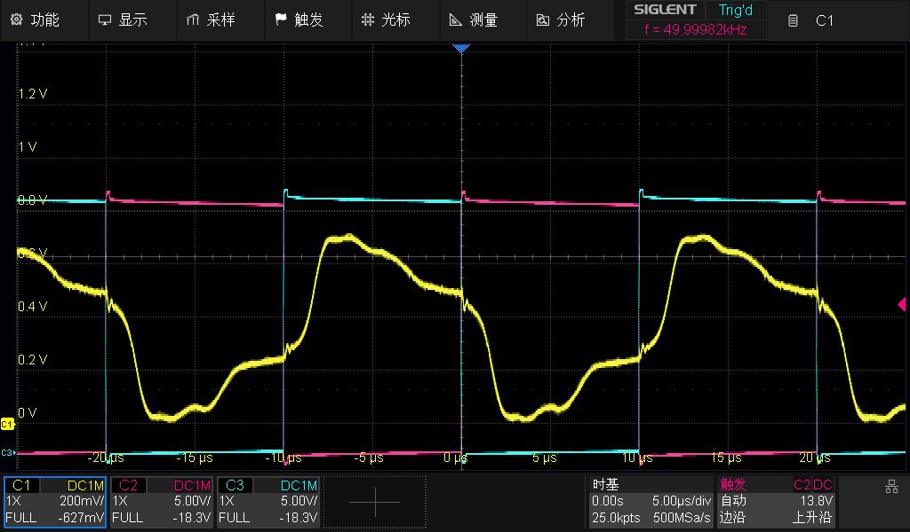 |

The blue traces are the lagging-leg SW node, the red traces are the leading-leg SW node, and the yellow traces are the AMC1311B sampling signal fed back to the primary side after differential amplification.

> [!NOTE]
> The voltage-divider sampling loop has a relatively large area and is directly below the transformer, so the feedback signal is subject to interference. The firmware includes targeted digital filtering to improve the measurement.

### 7.4 Startup waveforms

The startup waveforms were measured with a 3 kΩ resistive load. Load current was approximately 50 mA at 150 V output and 77 mA at 230 V output. These tests show the output-voltage buildup during closed-loop startup.

| 150 V / 50 mA | 230 V / 77 mA |
|---|---|
| 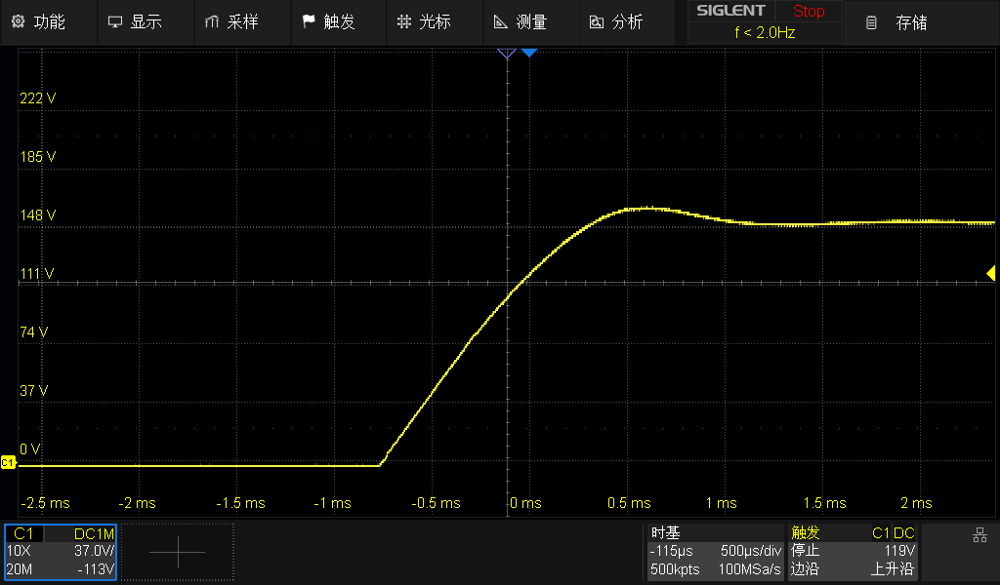 | 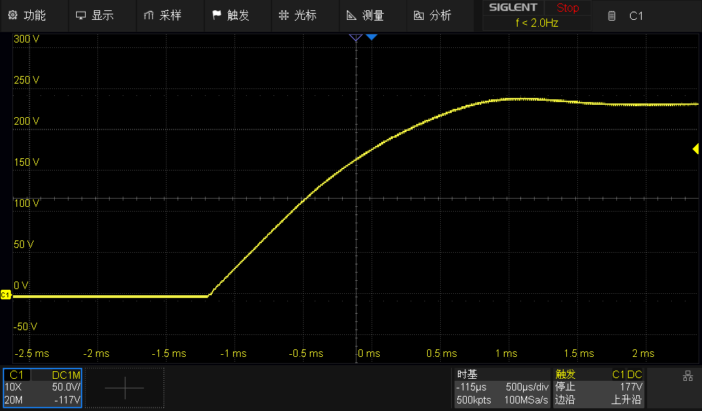 |

### 7.5 Output-voltage ripple

Output-voltage ripple was also measured with a 3 kΩ resistive load. The images show the 150 V / 50 mA and 230 V / 77 mA operating points.

| 150 V / 50 mA | 230 V / 77 mA |
|---|---|
| 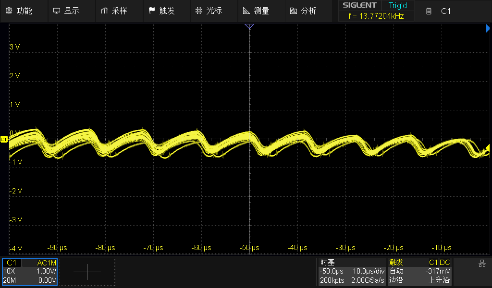 | 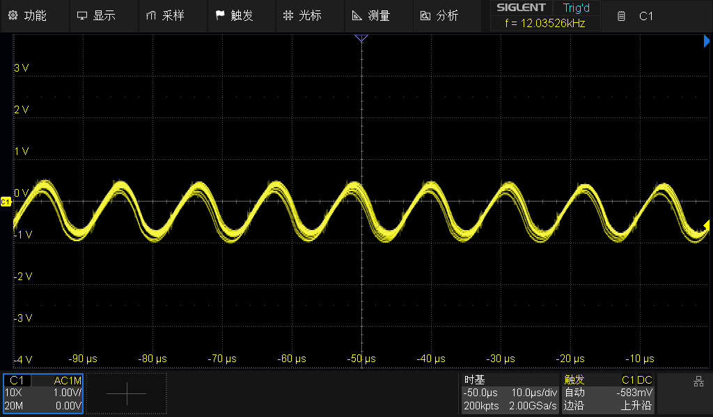 |

> [!NOTE]
> A high-voltage probe was not available, so ripple was first tested at lower output voltages.

### 7.6 Constant-current capacitor-charging test

[Watch the complete test video](https://github.com/AzidoPP/HVCCPS-V1.4/releases/download/videos-v1.4/HVCCPS-V1.4-Capacitor-CC-Charging-Test.mp4)

The test used two 1100 µF capacitors in series, for an equivalent capacitance of approximately 550 µF. The host interface was set to 2000 V with a 200 mA current limit. Charging took approximately 5.6 s; capacitor voltage rose nearly linearly, and peak output power was approximately 390 W. Based on the capacitor energy equation, the average charging power was approximately 195 W.

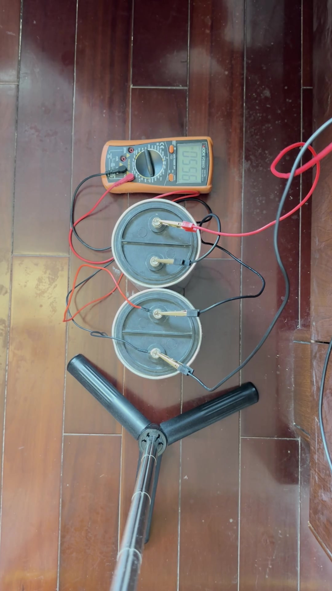

### 7.7 Constant-voltage resistive-load test

[Watch the complete test video](https://github.com/AzidoPP/HVCCPS-V1.4/releases/download/videos-v1.4/HVCCPS-V1.4-Resistive-CV-Test.mp4)

A 5 kΩ aluminum-housed resistor was connected to the output and the target voltage was set to 800 V. The output remained stable throughout the test, validating the constant-voltage loop and continuous-output capability.

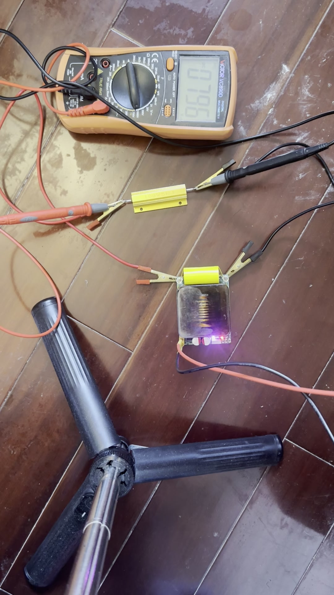

### 7.8 Arc test

[Watch the complete test video](https://github.com/AzidoPP/HVCCPS-V1.4/releases/download/videos-v1.4/HVCCPS-V1.4-Arc-Test.mp4)

The arc test visually demonstrates the high-voltage output. Arc testing is extremely dangerous and requires reliable insulation, grounding, current limiting, discharge provisions, and an external emergency stop. Do not attempt it without supervision.

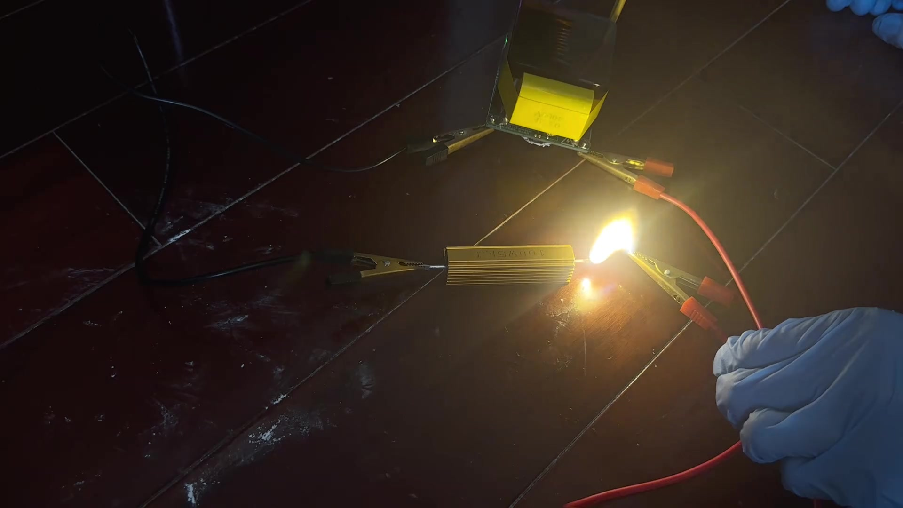

## 8. License and changelog

This repository is licensed under [GPL-3.0](LICENSE). See [`log.md`](log.md) for version history and detailed changes.

MCU vendor manuals are linked rather than copied into this repository. See [MCU reference documentation](Docs/references.md) for the official sources used by the project.
